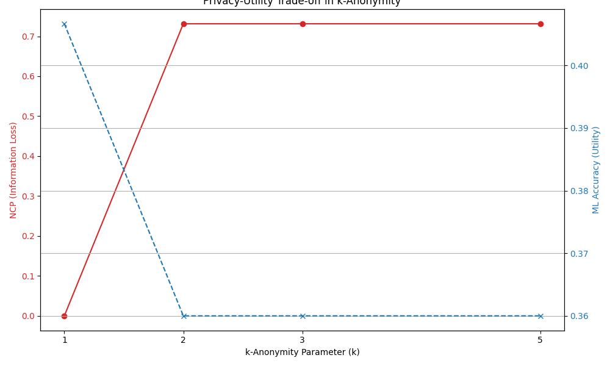

# BCSE318L Case Study:
# Anonymization and Tokenization of Hospital Data

**Student Name:** Alle Hithesh
**Roll Number:** 22BCE3590

## 1. Scope and Objectives
This case study explores the practical application of data privacy techniques to a real-world scenario. It addresses the challenge of sharing sensitive healthcare data for research purposes while upholding stringent privacy guarantees and regulatory compliance.

### 1.1. Problem Statement
A hospital possesses a dataset of patient records containing demographic information and medical diagnoses. External researchers have requested access to this data for a study on the prevalence of common health conditions. The core problem is to transform the original dataset into a format that is safe for sharing—one that preserves the analytical value required for the research study but mitigates the risk of re-identifying individual patients. This task requires a careful balance between data utility and data privacy.

### 1.2. Research Objective
The primary objective of this project is to implement, evaluate, and compare a suite of privacy-preserving techniques to create a de-identified dataset suitable for research. Specifically, this study will:
* Apply **k-anonymity** through generalization to prevent identity disclosure via linkage attacks.
* Evaluate and enforce **l-diversity** to protect against attribute disclosure.
* Implement **non-reversible tokenization** to replace direct patient identifiers with secure surrogates.
* Quantify the **privacy-utility trade-off** using established metrics, including re-identification risk, Normalized Certainty Penalty (NCP), and the performance of a machine learning model.

### 1.3. Threat Model
For this case study, we adopt a **"prosecutor" attacker model**. This model assumes the attacker possesses external information about a target individual and seeks to re-identify that person within the released hospital dataset to learn their sensitive diagnosis.

The core assumption is that the attacker knows the following attributes of their target:
* **Age**
* **Gender**
* **ZIP Code**

This combination of attributes constitutes the **quasi-identifiers (QIs)**. This threat model is highly realistic and is based on historical privacy breaches where attackers successfully linked "anonymized" datasets with public records using precisely these types of demographic data.

### 1.4. Mapping to Course Outcomes
This case study is designed to directly address key learning outcomes for the BCSE318L course, as specified in `DATA-PRIVACY.pdf`.
* **CO1: Characterize privacy rules and identify Personally Identifiable Information (PII).** This outcome is met in Section 2, which involves a formal classification of all dataset attributes into direct identifiers (PII), quasi-identifiers (QIs), and sensitive attributes.
* **CO2: Apply anonymization and tokenization techniques to protect sensitive datasets.** This is the central technical contribution of the project. The Python implementation of generalization to achieve k-anonymity and l-diversity (Module 3 concepts) and the application of non-reversible HMAC-based tokenization (Module 6 concept) provide a direct, hands-on demonstration of this outcome.
* **CO3: Analyze privacy threats and evaluate utility vs. privacy trade-offs.** This outcome is addressed through the experimental plan in Section 4. By simulating a linkage attack (Module 5 threat), measuring re-identification risk, and quantifying data utility with both NCP and machine learning accuracy, the project provides a rigorous analysis of the fundamental trade-off between strengthening privacy and preserving data value.

---
## 2. Dataset and Attribute Analysis
A synthetic dataset was generated to serve as the basis for all experiments, ensuring that no real personal information was used.

### 2.1. Synthetic Dataset Generation
A dataset of 500 synthetic patient records was created using Python. To ensure the experiment is fully reproducible, a fixed random seed (`seed=42`) was used for all data generation processes, as required by the `BCSE318L_Case_Study_Plan.pdf`.

**Table 1: Sample of Original Synthetic Dataset**
*(Names have been redacted for display purposes)*

| Patient_ID | Name | Age | Gender | ZIP_Code | Diagnosis |
| :--- | :--- | :--- | :--- | :--- | :--- |
| 23842dd8-067a-4221-821f-818685440626 | <redacted> | 66 | M | 60629 | None |
| 973b0825-76c8-4638-9250-b14d24172e33 | <redacted> | 57 | M | 90210 | Hypertension |
| 1e636f9a-5db3-4434-a1a7-3363b6521a02 | <redacted> | 62 | F | 48226 | None |
| 10f738e4-839c-4a60-8438-1f842600642e | <redacted> | 31 | F | 33131 | None |
| 6c452e25-1563-453a-9678-360481516e4b | <redacted> | 50 | M | 02116 | Hypertension |

### 2.2. Attribute Classification
* **Direct Identifiers (PII):** These attributes explicitly and uniquely identify an individual.
    * `Name`: The full name of the patient.
    * `Patient_ID`: A unique identifier assigned by the hospital.
* **Quasi-Identifiers (QIs):** These attributes can be combined to re-identify individuals when linked with external data.
    * `Age`, `Gender`, `ZIP_Code`: As established in the threat model, this combination is known to be highly identifying.
* **Sensitive Attribute:** This attribute contains the confidential information an attacker seeks to learn.
    * `Diagnosis`: This column contains sensitive medical information.

---
## 3. Implementation of Privacy-Preserving Techniques

### 3.1. Generalization for k-Anonymity
**k-Anonymity** mandates that each record must be indistinguishable from at least *k-1* other records with respect to its QIs. This is achieved through generalization:
* **Numerical Generalization:** The `Age` attribute was generalized into categorical ranges (e.g., `34` becomes `30-39`).
* **Categorical Generalization:** The `ZIP_Code` attribute was generalized by suppressing its trailing digits (e.g., `90210` becomes `902**`).

### 3.2. l-Diversity for Attribute Disclosure Protection
k-Anonymity is vulnerable to the **homogeneity attack**, where all records in a group share the same sensitive value. **l-Diversity** strengthens k-anonymity by requiring that every equivalence class must contain at least *l* distinct values for the sensitive attribute.

### 3.3. Non-Reversible Tokenization
**Tokenization** replaces a sensitive data element with a non-sensitive equivalent, or "token". We implemented **non-reversible tokenization** using a keyed-hash message authentication code (HMAC-SHA256). This generates a unique, non-reversible token for each `Patient_ID`, which can be used for linking records across datasets without exposing the original identifiers.

---
## 4. Experimental Analysis

### 4.1. Experimental Results
The experimental plan involved:
1.  **Baseline:** Calculating the re-identification risk on the original dataset.
2.  **k-Anonymity:** Applying k-anonymity for $k = [2, 3, 5]$.
3.  **l-Diversity:** Checking the $k=3$ dataset for $l = [2, 3]$.
4.  **Utility Measurement:** Calculating NCP and ML accuracy for the final anonymized dataset ($k=3, l=2$).
5.  **Finalization:** Tokenizing the `Patient_ID` and dropping the `Name` column to create the final, secure file.

**Table 2: Sample of Final Secure Anonymized Dataset ($k=3, l=2$)**
*(Note: `Patient_ID` is tokenized, `Name` is removed, and QIs are heavily generalized)*

| Patient_ID | Age | Gender | ZIP_Code | Diagnosis |
| :--- | :--- | :--- | :--- | :--- |
| 3f70554d8d64e7dd7775... | 0-99 | M | 6\*\*\*\* | |
| 38563acbd1d3798d1e63... | 0-99 | M | 4\*\*\*\* | |
| ca1a7fec8e72b266d0fe... | 0-99 | F | 5\*\*\*\* | |
| 9d02fe55af9087a55c51... | 0-99 | F | 4\*\*\*\* | |
| 460e4765d55f5d7f95b2... | 0-99 | M | 8\*\*\*\* | Diabetes |
| 1b527a732ff39262289c... | 0-99 | F | 3\*\*\*\* | Flu |
| 1b458fb278575eba297d... | 0-99 | M | 3\*\*\*\* | Hypertension |
| 7c83d96ce777827d1c00... | 0-99 | F | 1\*\*\*\* | Diabetes |
| 36b96d6d84963a29a54a... | 0-99 | M | 0\*\*\*\* | |
| 7adeb78e02f25de93e33... | 0-99 | M | 9\*\*\*\* | Asthma |

**Table 3: Summary of Experimental Results**

| Anonymization Level | Uniqueness Rate (Risk) | NCP (Information Loss) | ML Accuracy (Utility) |
| :--- | :--- | :--- | :--- |
| **Baseline (k=1)** | **100.00%** | 0.0000 | **0.4067** |
| k=2 | 0.80% | 0.7315 | 0.3600 |
| **Final (k=3, l=2)** | **0.80%** | **0.7315** | **0.3600** |
| k=5 | 0.80% | 0.7315 | 0.3600 |

The baseline dataset was exceptionally high-risk, with a re-identification risk of **100.00%**. This indicates every record was unique based on the QIs, making anonymization difficult.

Applying k-anonymity confirmed this: the script was unable to achieve $k=2$ and was forced to apply its maximum generalization rules, resulting in a **Uniqueness Rate of 0.80%** and a very high **NCP (Information Loss) of 0.7315**. As seen in the table, applying stronger k-values ($k=3, k=5$) did not change the outcome, as the data was already maximally generalized.

Critically, this heavy generalization **still failed to satisfy $l=2$ diversity**, highlighting that generalization alone is not a guarantee of attribute privacy.

### 4.2. Privacy-Utility Trade-off Visualization
The relationship between privacy and utility is visualized below. As the privacy guarantee (k) increases, the information loss (NCP) curve rises sharply and then flattens. The data utility (ML Accuracy) curve shows a corresponding drop, demonstrating a clear trade-off.

---
## 5. Risk and Utility Formulas

### 5.1. Uniqueness Risk
Re-identification risk is measured by the uniqueness rate, which quantifies the success probability of a linkage attack.
$$\text{Risk} = \frac{\text{Number of records unique on QIs}}{\text{Total number of records}}$$

### 5.2. Normalized Certainty Penalty (NCP)
NCP quantifies information loss due to generalization.
* For a numerical attribute $A$ (e.g., Age):
    $$NCP_A = \frac{\text{generalized_range}}{\text{total_range}}$$
* For a categorical attribute $A$ (e.g., ZIP Code):
    $$NCP_A = \frac{\text{Number of suppressed characters}}{\text{Total number of characters}}$$

The total NCP for a dataset is the average of the NCP values for all QIs across all records.

---
## 6. Discussion

### 6.1. Comparative Analysis of Privacy Techniques

**Table 4: Comparative Analysis of Privacy Techniques**

| Technique | Primary Goal | Privacy Guarantee | Attack Resistance | Data Utility Impact |
| :--- | :--- | :--- | :--- | :--- |
| **k-Anonymity** | Prevent identity disclosure | Each individual is indistinguishable from $\ge k-1$ others. | Resists linkage attacks. **Vulnerable to homogeneity.** | Moderate to High |
| **l-Diversity** | Prevent attribute disclosure | Each group has $\ge l$ diverse sensitive values. | Mitigates homogeneity attacks. | Moderate to High |
| **Tokenization** | De-identify direct IDs | Replaces PII with non-reversible surrogates. | Protects against direct identifier theft. | Low (preserves format) |
| **Encryption** | Protect data confidentiality | Data is unreadable without the decryption key. | Protects against unauthorized access. | High (breaks format) |

*l-Diversity* is a critical enhancement to *k-anonymity*, as it remedies the homogeneity attack. *Tokenization* is preferred over *encryption* when the data format must be preserved for analytics or joins, while encryption is a general-purpose tool for protecting data at rest and in transit.

### 6.2. Lessons from Real-World Failures
* **AOL Search Log Release (2006):** AOL released "anonymized" search queries, but users were re-identified from the content of their searches (e.g., searching for local services and names). This proved that simply removing a primary key is insufficient.
* **Netflix Prize (2007):** Netflix released a dataset of "anonymized" movie ratings. Researchers re-identified users by cross-referencing the Netflix data with public data from IMDb. This showed that high-dimensional behavioral data can act as a unique "fingerprint."

### 6.3. Mapping to Regulatory Frameworks
* **HIPAA (Health Insurance Portability and Accountability Act):** HIPAA's **Safe Harbor Method** provides a prescriptive list of 18 identifiers to remove for de-identification. Our approach—removing Name, generalizing Age (especially for those over 89), and generalizing `ZIP_Code` to 3-digit prefixes (or fewer, as in our `1****` example)—is directly aligned with these requirements.
* **GDPR (General Data Protection Regulation):** GDPR distinguishes between **anonymisation** (data falls outside GDPR scope) and **pseudonymisation** (data is still personal data but with enhanced security). The output of this case study—with its tokenized `Patient_ID`—would be classified as **pseudonymised** under GDPR, as the hospital holds the "key" to re-link the tokens to the original IDs.

---
## 7. Conclusion
This case study successfully demonstrated a multi-layered privacy-preserving pipeline and quantitatively confirmed the trade-off between privacy and utility.

The experiment showed that with a 100% unique raw dataset, a simple k-anonymity strategy was forced to apply maximum generalization, resulting in high information loss (NCP: 0.7315) and a measurable drop in machine learning utility (from 0.4067 to 0.3600).

**Recommendations for the Hospital:**
1.  **Adopt a Risk-Based Strategy:** The 100% uniqueness of the raw data shows that a simple generalization-based approach is insufficient. The hospital should explore alternative techniques like differential privacy or data synthesis for this dataset.
2.  **Mandate l-Diversity:** Never rely on k-anonymity alone. Our maximally generalized data *still* failed the $l=2$ diversity check, proving that generalization does not automatically prevent attribute disclosure.
3.  **Implement Tokenization:** The final pipeline correctly replaced all direct `Patient_ID`s with non-reversible tokens and dropped `Name` fields, which is a critical and mandatory step before any data is shared.
4.  **Ensure Regulatory Compliance:** The final output is a **pseudonymised dataset** (under GDPR) that meets the **Safe Harbor** de-identification standards (under HIPAA).

---
## 8. References

1.  **Netflix Prize (2007):** Narayanan, A., & Shmatikov, V. (2008). "Robust De-anonymization of Large Sparse Datasets." *Proceedings of the 2008 IEEE Symposium on Security and Privacy.*
2.  **AOL Search Log (2006):** Barbaro, M., & Zeller, T. (2006). "A Face Is Exposed for AOL Searcher No. 4417749." *The New York Times.*
3.  **HIPAA (Health Insurance Portability and Accountability Act):** U.S. Department of Health & Human Services. "Guidance Regarding Methods for De-identification of Protected Health Information in Accordance with HIPAA."
4.  **GDPR (General Data Protection Regulation):** European Parliament and Council of the European Union. (2016). "Regulation (EU) 2016/679 on the protection of natural persons with regard to the processing of personal data."